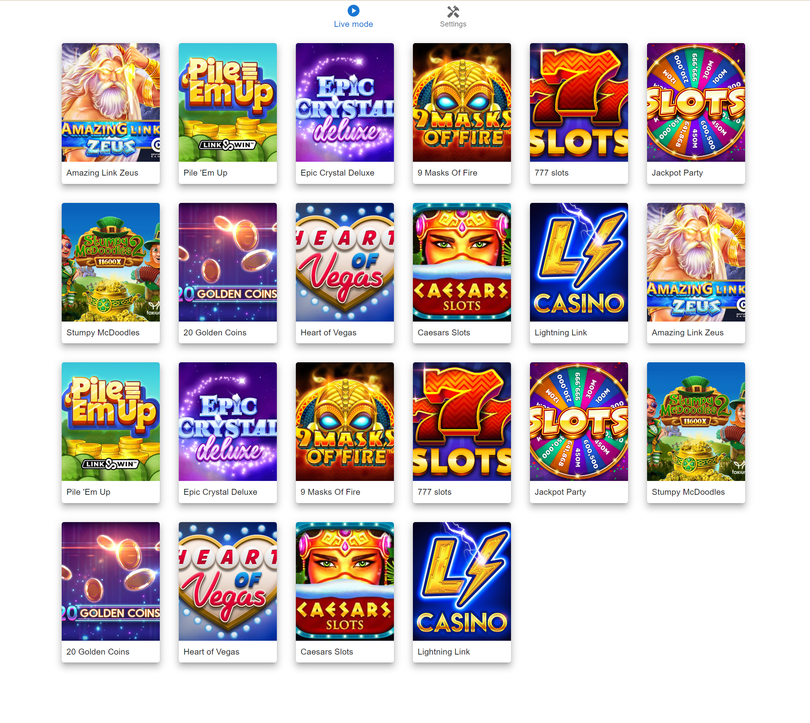

# Dashboard task

Application requires a page refresh in case of layout change from/to mobile layout to properly support click and tap events correctly.

### Available Scripts

In the project directory, you can run:

### `npm start`

Runs the app in the development mode.\
Open [http://localhost:3000](http://localhost:3000) to view it in the browser. 

